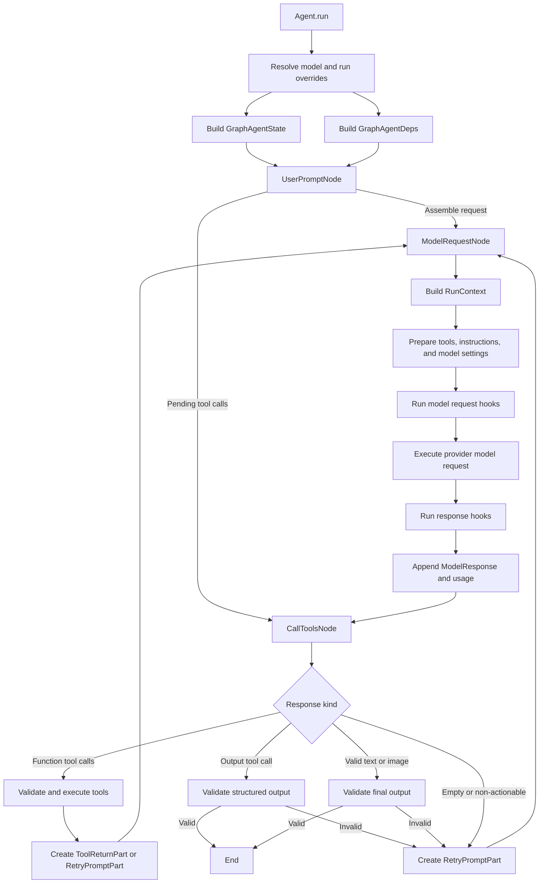
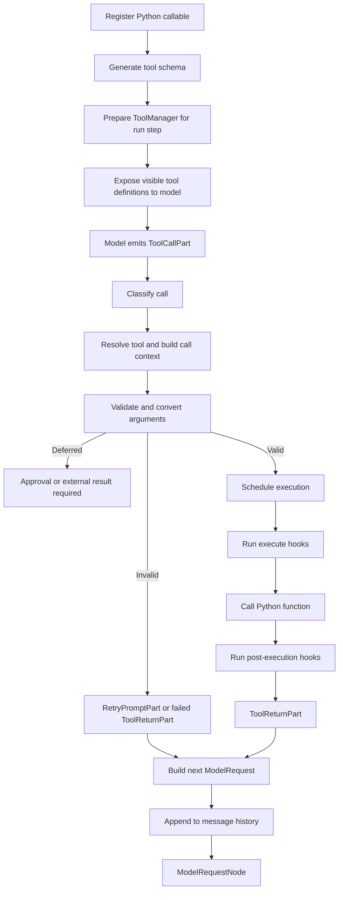

# PydanticAI Agent Loop

This document describes the execution model of the PydanticAI agent runtime. It answers six questions:

1. Where do the arguments passed to `Agent(...)` go?
2. How is a single `Agent.run(...)` driven?
3. What is each graph node responsible for?
4. How does a tool move from registration to exposure, validation, execution, and result delivery?
5. How are state, dependencies, and `RunContext` assembled and maintained?
6. What does PydanticAI solve, and what framework coupling does it introduce?

> This document is based on the source code of PydanticAI `2.35.0`, the version currently installed in this project. Modules such as `_agent_graph.py` and `_tool_execution.py` are private implementation details and must not be imported by application code. Their internals may change in later releases.

## 1. Mental Model

A minimal agent loop can be described as follows:

```python
messages = initial_history + [user_prompt]

while True:
    response = await model.request(messages, available_tools)
    messages.append(response)

    if response.requests_function_tools:
        tool_results = await validate_and_execute(response.tool_calls)
        messages.append(tool_results)
        continue

    final_output = validate_output(response)
    return final_output
```

PydanticAI does not implement this behavior as one explicit `while` loop. It represents the loop as a graph driven by `pydantic_graph`:

```text
UserPromptNode
      ↓
ModelRequestNode ←──────────────┐
      ↓                         │
CallToolsNode ── function tool ─┘
      │
      ├── valid final output ──→ End
      └── invalid output ──────→ ModelRequestNode
```

This leads to three important distinctions:

- One `run()` starts at the graph input and finishes at one `End` node.
- A single `run()` may contain multiple model requests and multiple tool-call rounds.
- A multi-turn user conversation is not automatically kept inside one `run()`. The caller continues a conversation by passing previous messages through `message_history=` to the next `run()`.

## 2. Construction Time vs. Run Time

### 2.1 `Agent(...)`: Store a Reusable Blueprint

When an agent is created, its arguments are primarily normalized and stored as reusable instance configuration:

```python
agent = Agent(
    model=model,
    deps_type=AgentDeps,
    output_type=TriageResult,
    system_prompt=SYSTEM_PROMPT,
    tools=[...],
    retries=2,
    capabilities=[...],
)
```

The main constructor arguments are handled as follows:

| Constructor argument | Construction-time handling | Run-time purpose |
|---|---|---|
| `model` | Stored as a default model object or model ID | Resolved into the effective `Model` for a run |
| `deps_type` | Stored as type information | Constrains the type of user dependencies injected into a run |
| `output_type` | Converted into an `OutputSchema` | Validates final output and may create an output tool |
| `instructions` / `system_prompt` | Normalized and stored | Added while preparing model requests |
| `model_settings` | Stored as a static mapping or callable | Resolved before each model request |
| `retries` | Split into tool and output retry budgets | Applied during tool and output validation failures |
| `tools` | Wrapped in a function toolset | Prepared and exposed to the model on each step |
| `toolsets` | Stored as static or dynamic toolsets | Resolved for each run step |
| `capabilities` | Combined into a root capability | Inject behavior into run, model, tool, and output lifecycles |
| `end_strategy` | Stored as execution policy | Controls behavior when tool calls and final output coexist |
| `tool_timeout` | Stored as the default timeout | Applied around tool execution |
| `max_concurrency` | Converted into a concurrency limiter | Limits concurrent agent runs |

Construction does not execute a tool or run the graph. Most model resolution, dynamic tool preparation, state creation, and graph execution happens when `run()` is called.

### 2.2 `Agent.run(...)`: Assemble One Execution Environment

Each call to `run()` performs the following high-level work:

1. Resolve precedence among run arguments, test overrides, agent specifications, and agent defaults.
2. Resolve the effective model for this run.
3. Build the fixed-topology agent graph.
4. Create a new `GraphAgentState`.
5. Create the run-specific `GraphAgentDeps`.
6. Start `graph.iter(...)` with a `UserPromptNode` as input.
7. Advance graph nodes until the graph returns `End`.
8. Wrap the final output, messages, usage, and metadata in an `AgentRunResult`.

The same `Agent` instance can be run repeatedly because the agent stores a shared blueprint while each run gets independent state and runtime dependencies.

## 3. Runtime State and Context

### 3.1 `GraphAgentState`: Where This Run Currently Is

`GraphAgentState` is mutable state owned by one graph run. It includes:

- `message_history`: model requests, model responses, tool calls, and tool results;
- `usage`: accumulated requests, tokens, tool calls, and cost;
- `output_retries_used`: the output-validation retry counter;
- `run_step`: the current model-request step;
- `run_id`: the identifier of this run;
- `conversation_id`: the identifier used to associate related runs;
- pending messages, the event buffer, and the per-run MCP tool-definition cache.

This state is not automatically persisted after the run. If the next `run()` does not receive the previous `message_history`, the next run will not inherit the previous run's conversational memory.

### 3.2 `GraphAgentDeps`: How This Graph Run Should Operate

`GraphAgentDeps` is an internal PydanticAI container that holds the configuration and dependencies required to run the graph. It includes:

- `model` and an optional `model_selector`;
- `tool_manager`;
- `output_schema` and output validators;
- `usage_limits`;
- the root capability and registered capabilities;
- instrumentation and tracing configuration;
- the end strategy;
- cancellation state;
- `user_deps`.

The internal `GraphAgentDeps` and this project's `AgentDeps` are not the same abstraction:

```text
GraphAgentDeps                         # Internal runtime dependencies
├── model
├── tool_manager
├── usage_limits
├── capabilities
└── user_deps ───────────────────────→ AgentDeps(...)  # Application dependencies
```

The framework stores the project's `AgentDeps` instance inside `GraphAgentDeps.user_deps`.

### 3.3 `RunContext`: A Runtime View Assembled from State and Dependencies

PydanticAI calls `build_run_context()` around model requests, dynamic instructions, tool validation, and tool execution. It assembles a `RunContext` from current graph state and graph dependencies:

```text
GraphAgentState                         GraphAgentDeps
├── usage                               ├── user_deps
├── messages                            ├── model
├── run_step                            ├── usage_limits
├── run_id                              ├── tool_manager
├── conversation_id                    └── capabilities
└── metadata                                  │
          └──────────────┬────────────────────┘
                         ↓
                 RunContext[AgentDeps]
```

Application tools access the project-defined dependency object through `ctx.deps`:

```python
@agent.tool
async def read_document(ctx: RunContext[AgentDeps], path: str) -> str:
    return await ctx.deps.document_store.read(path)
```

`RunContext` is an assembled view of the current run. The framework rebuilds it at different lifecycle stages. Some sets, buffers, and controllers are shared by reference so tool discovery, pending messages, cancellation, and event delivery remain consistent within the same run step.

## 4. Graph Nodes

PydanticAI uses a fixed graph topology, but each node dynamically selects its next node based on history, model output, and tool results.

### 4.1 `UserPromptNode`

**Responsibility:** prepare the first request to be handled by the graph. It does not call the model.

Main pipeline:

1. Read `GraphAgentState.message_history`.
2. Clean and repair history so it satisfies provider message constraints.
3. Handle deferred tool results, interrupted requests, suspended responses, and other resume cases.
4. Re-evaluate dynamic system prompts and instructions.
5. Add system prompt parts for a new conversation.
6. Add the current `UserPromptPart`.
7. Construct and return a `ModelRequestNode`.

History normalization includes:

1. Removing orphaned tool results that have no matching tool call.
2. Synthesizing closing results for dangling tool calls when necessary.
3. Merging consecutive messages into a provider-valid structure.

This is provider-valid history normalization, not semantic context compaction. Context trimming or summarization should be handled explicitly by a history processor, capability, or application service.

If history already contains unprocessed tool calls, `UserPromptNode` may skip a new model request and return a `CallToolsNode` directly.

### 4.2 `ModelRequestNode`

**Responsibility:** prepare and execute one real model request.

Main pipeline:

1. Increment `run_step`.
2. Build the current `RunContext`.
3. Prepare the `ToolManager` and visible tool definitions for this step.
4. Resolve dynamic model selection, model settings, and instructions.
5. Build provider request parameters.
6. Run `before_model_request` and `wrap_model_request` hooks.
7. Execute the provider model request.
8. Run `after_model_request` or `on_model_request_error` hooks.
9. Accumulate usage and enforce usage limits.
10. Append the `ModelResponse` to `message_history`.
11. Unconditionally return `CallToolsNode(response)`.

`ModelRequestNode` does not decide whether the run should end or whether tools should execute. Even a response with no tool call is passed to `CallToolsNode` for unified parsing and output validation.

### 4.3 `CallToolsNode`

**Responsibility:** parse the model response and route the next action. This is the main decision node in the loop.

Main pipeline:

1. Parse response parts into text, tool calls, files, thinking parts, and other content.
2. Handle empty responses, thinking-only responses, content filtering, and token-limit failures.
3. If tool calls exist, classify, validate, schedule, and execute them.
4. If valid text, image, or structured output exists, run output validation.
5. If the output is valid, return `End(FinalResult)`.
6. If the response is not actionable or the output is invalid, create a `RetryPromptPart` and return a new `ModelRequestNode`.

The original model response has already been written to history by `ModelRequestNode` before `CallToolsNode` processes it. This is intentional: when a response is rejected, the next model request includes both the rejected output and the reason it was rejected.

### 4.4 `SetFinalResult`

`SetFinalResult` is a shortcut used in streaming execution. When a final result has already been established during streaming, this node returns immediately:

```text
SetFinalResult → End
```

The normal non-streaming path usually reaches `End` through `CallToolsNode`.

## 5. End-to-End Execution Flow



## 6. Tool Execution Flow

Tool execution includes more than calling a Python function after the model selects it. The complete lifecycle includes registration, per-step preparation, model selection, validation, scheduling, execution, result normalization, and message write-back.

### 6.1 Registration

Tools can be registered in several ways:

```python
@agent.tool
def contextual_tool(ctx: RunContext[AgentDeps], query: str) -> str:
    ...

@agent.tool_plain
def pure_tool(query: str) -> str:
    ...

agent = Agent(model, tools=[Tool(shared_function)])
```

During registration, the framework:

1. Stores the Python callable.
2. Determines whether it accepts `RunContext`.
3. Generates JSON Schema from its signature, type annotations, and docstring.
4. Stores retry, timeout, approval, sequential, and deferred-loading metadata.
5. Adds the tool to a function toolset.

Registration does not execute the tool and does not have access to a run-specific `RunContext`.

### 6.2 Per-Step Tool Preparation

Before each model-request step, PydanticAI calls `ToolManager.for_run_step(ctx)`:

1. Settle the previous step's per-tool retry state.
2. Remove retry counts for tools that succeeded.
3. Increment retry counts for tools that failed.
4. Call the toolset's `for_run_step()` method.
5. Resolve the tools available in the current context.
6. Create the current step's `ToolManager`.
7. Add visible tool definitions to the model request parameters.

The visible tool catalog can therefore change between steps. Visibility may depend on user permissions, the current step, loaded capabilities, tool-search results, or dynamic toolsets.

### 6.3 Model Emits Tool Calls

The model receives tool definitions, not direct access to Python functions. A model response may contain:

```text
ToolCallPart(
    tool_name="read_document",
    args={"path": "notes.md"},
    tool_call_id="..."
)
```

`CallToolsNode` classifies each call as one of the following:

- **Function tool:** performs an action or retrieves information and normally returns its result to the model.
- **Output tool:** submits a candidate final structured output and may end the run after validation.
- **Deferred or external tool:** requires external execution or approval.
- **Unknown tool:** does not resolve to an available definition.

### 6.4 Validation

Before any business side effect occurs, `ToolManager.validate_tool_call()` runs this pipeline:

```text
Resolve tool name
  ↓
Build per-call RunContext
  ↓
before_tool_validate
  ↓
Pydantic schema validation and type conversion
  ↓
Custom args_validator
  ↓
after_tool_validate
  ↓
ValidatedToolCall
```

The result is represented as a `ValidatedToolCall`:

- On success, `args_valid=True` and `validated_args` contains converted arguments.
- On a parameter error or `ModelRetry`, `args_valid=False` and the object carries a model-visible retry error.
- On `ToolFailed`, it carries a terminal tool failure.
- On `ApprovalRequired` or `CallDeferred`, the arguments are valid, but execution is deferred.

Separating validation from execution allows the framework to:

- report argument validity before any side effect occurs;
- request human approval only after arguments are valid;
- distinguish invalid arguments from execution failures;
- validate a batch before scheduling concurrent execution.

### 6.5 Scheduling Multiple Tool Calls

Multiple tool calls are not strictly sequential by default. Scheduling is controlled by `end_strategy`, per-tool `sequential`, and the run-scoped parallel-execution mode.

#### `end_strategy='graceful'` — Default

- Walk tool calls in model emission order.
- Group consecutive function tools into parallel batches.
- Complete the preceding function batch before processing an output tool.
- Process output tools in emission order; the first valid output wins.

#### `end_strategy='early'`

- Prioritize output tools.
- Once the first valid output succeeds, ordinary function tools may be skipped.
- This is useful when committing a final output is more important than executing additional side effects.

#### `end_strategy='exhaustive'`

- Execute all possible tools in parallel.
- The first valid output by emission order becomes the final result.
- Other tools still execute, so this strategy requires care when tools have side effects.

#### `sequential=True`

A tool marked `sequential=True` acts as a barrier:

1. Tools before the barrier complete first.
2. The barrier tool runs alone.
3. Tools after the barrier start only after it completes.

When two actions have a real data dependency, such as locating a document section before editing it, the safer design is often to let the model make the calls in separate model steps instead of emitting both dependent calls in the same response.

### 6.6 Execution

After validation, `ToolManager.execute_tool_call()` runs this pipeline:

```text
Check validation result and deferral state
  ↓
before_tool_execute
  ↓
wrap_tool_execute
  ↓
FunctionToolset.call_tool
  ↓
tool.call_func(validated_args, RunContext)
  ↓
after_tool_execute
```

When instrumentation is enabled, `wrap_tool_execute` creates an OpenTelemetry span around the call. Tool timeout enforcement also wraps the actual function execution.

### 6.7 Result and Error Normalization

Successful tool results are converted into `ToolReturnPart` objects. Important failure paths include:

| Condition | Framework representation | Effect on the run |
|---|---|---|
| Invalid schema or arguments | `RetryPromptPart` | Ask the model to correct the call and consume retry budget |
| Tool raises `ModelRetry` | `RetryPromptPart` | Ask the model to retry; exceeding the budget terminates the run |
| Tool raises `ToolFailed` | Failed `ToolReturnPart` | Tell the model the operation failed without retrying it in the same way |
| `ApprovalRequired` | Deferred request | Pause the side effect until approval is supplied |
| `CallDeferred` | Deferred request | Wait for an external system to execute or return the result |
| Timeout | `ModelRetry` path | Allow a model-visible retry and consume tool retry budget |
| Unknown or unavailable tool | Retry path | Tell the model that the requested tool cannot be called |

### 6.8 Write-Back and Loop Continuation

After function tools have been processed:

1. Results and failures become `ToolReturnPart` or `RetryPromptPart` objects.
2. Multiple result parts are assembled into the next `ModelRequest`.
3. The request is appended to `message_history`.
4. `CallToolsNode` returns a new `ModelRequestNode`.
5. The model sees the preceding calls and results, then decides whether to call more tools or produce final output.



## 7. Function Tools vs. Output Tools

These concepts serve different purposes:

| Type | Purpose | Typical destination after success |
|---|---|---|
| Function tool | Retrieve information or perform a business side effect | Return the tool result to the model and continue the loop |
| Output tool | Submit final data that conforms to an output schema | Produce `FinalResult` and end the run after validation |

This project's `SingleRun` rejects ordinary `tools` and `toolsets`, but it uses:

```python
output_type=TriageResult
```

PydanticAI may still create an internal output tool for this structured result. Therefore, “no function tools” does not mean that `CallToolsNode` can never receive a tool call.

## 8. Message-History Lifecycle

A run begins with:

```text
run(message_history=previous_messages)
  ↓
GraphAgentState.message_history
  ↓
UserPromptNode cleans and repairs history
```

A run may append messages in this shape:

```text
ModelRequest(user/system/tool results)
ModelResponse(text/tool calls)
ModelRequest(tool returns/retry prompts)
ModelResponse(...)
...
```

Important rules:

- The model response is appended before `CallToolsNode` processes it.
- A response remains in history even if output validation later rejects it.
- The retry reason enters the next request as a `RetryPromptPart`.
- The model therefore sees both what it previously produced and why it was rejected.
- To continue memory across runs, the caller must preserve `result.all_messages()` and supply it to the next run.

## 9. Capabilities and Instrumentation

### 9.1 Capabilities

A capability is PydanticAI's cross-cutting extension mechanism. It can participate in:

- the overall run lifecycle;
- model selection, requests, responses, and errors;
- tool-definition preparation;
- tool validation;
- tool execution;
- output validation and processing;
- event streaming.

Representative hooks include:

```text
wrap_run
before_model_request
wrap_model_request
after_model_request
on_model_request_error
before_tool_validate
after_tool_validate
before_tool_execute
wrap_tool_execute
after_tool_execute
```

Multiple capabilities are composed into one root capability. Graph nodes depend on a stable hook interface instead of directly depending on logging, auditing, content filtering, dynamic tools, or tracing implementations.

### 9.2 Instrumentation

Instrumentation is a concrete capability that creates OpenTelemetry spans through wrapper hooks:

- `wrap_run` records the full agent run.
- `wrap_model_request` records each model request, response, usage, and latency.
- `wrap_tool_execute` records tool names, arguments, results, exceptions, and duration.
- Failure paths record exceptions and span status.

In this project:

```python
agent.instrument = True
```

enables OTel spans from the agent runtime. The `TracerProvider` and exporter configured in `core/telemetry.py` determine where those spans are sent.

## 10. Failure Paths

Failures can occur throughout the loop, not only inside tool functions:

```text
Before a model request
├── model or configuration resolution error
├── usage limit exceeded
└── capability rejects the request

During a model request
├── provider or network error
├── timeout or rate limit
└── cancellation

After a model response
├── content filter
├── empty or thinking-only response
├── incomplete tool call
└── output validation error

During tool handling
├── unknown or unavailable tool
├── invalid arguments
├── approval or deferred execution
├── timeout
├── retryable tool failure
└── terminal tool failure
```

PydanticAI converts model-correctable failures into model-visible retry or result parts. Provider errors, exhausted retry budgets, usage-limit violations, and unhandled exceptions can still terminate the complete run. The application must therefore classify errors at the agent boundary and map them to user-facing responses.

## 11. What PydanticAI Solves

PydanticAI provides:

- graph driving and termination;
- model and provider abstractions;
- message-history normalization and maintenance;
- automatic tool-schema generation;
- tool registration, lookup, visibility, and dynamic preparation;
- argument type validation and custom validators;
- tool concurrency, sequential barriers, and end strategies;
- conversion of tool results and errors into model-visible messages;
- structured output and output validation;
- per-tool and output retry budgets;
- usage tracking and usage limits;
- lifecycle hooks, capabilities, and instrumentation;
- streaming, deferred calls, approval, and cancellation control flows.

Application developers remain responsible for:

- defining the agent's business goal and instructions;
- designing tool responsibilities and schemas;
- injecting business dependencies;
- assigning correct error semantics;
- selecting execution and end strategies;
- persisting cross-run messages and business state;
- establishing application-level observability, evaluation, and security boundaries.

## 12. Coupling and Trade-offs

Using PydanticAI couples the application to:

1. `Agent`, `RunContext`, and `Tool` types;
2. function-signature conventions for `@agent.tool` and `@agent.tool_plain`;
3. Pydantic schema and validation semantics;
4. `ModelRetry`, `ToolFailed`, approval, and deferred-execution semantics;
5. PydanticAI's message model and history format;
6. output tools, end strategies, and capability-hook lifecycles;
7. framework rules for retries, tool scheduling, and final-result precedence.

Ways to limit this coupling include:

- Keep business services independent from `RunContext`.
- Make tool functions thin protocol adapters that call framework-independent services.
- Translate framework exceptions and business exceptions at the application boundary.
- Never import private modules such as `_agent_graph.py` from application code.
- Test important public behavior instead of depending on private class names.
- Document why PydanticAI was selected and what replacing it would cost.

## 13. Current Project Observations

The project currently has the following properties:

1. `SingleRun` wraps a PydanticAI `Agent` and returns `result.output`.
2. `SingleRun` rejects ordinary function tools, so it represents a predefined single-step workflow.
3. `TriageResult` is structured output and may be produced through an output tool.
4. `AgentDeps` is declared, but the current CLI does not pass a `deps=` instance, so it does not yet participate in runtime behavior.
5. The CLI does not pass prior `message_history`, so every input starts an independent run.
6. Instrumentation is enabled, while the telemetry provider is initialized explicitly at the application entry point.
7. The project still needs a real agent with function tools to verify the full tool loop, failure handling, and dependency injection in application code.

## 14. Interview-Ready Summary

> A PydanticAI agent is not implemented as one simple application-level while loop. It is a fixed state graph driven by `pydantic_graph`. Each run creates independent `GraphAgentState` and `GraphAgentDeps`. `UserPromptNode` normalizes history and assembles the initial request. `ModelRequestNode` prepares context, tools, model settings, and executes the model call. `CallToolsNode` parses every response and decides whether to execute function tools, validate an output tool, retry, or finish. Tools are registered and converted into schemas during construction, then dynamically prepared for each run step. Calls are validated before execution, scheduled according to end strategy and sequential barriers, and converted into model-visible results or errors that are written back to history. PydanticAI provides the loop, tool protocol, validation, scheduling, message maintenance, and instrumentation, while the application remains responsible for business boundaries, error semantics, persistence across runs, security, and evaluation.
